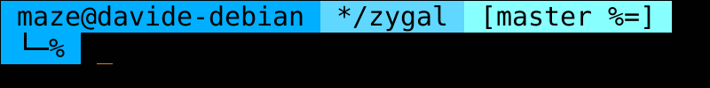
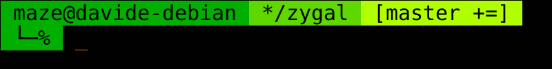
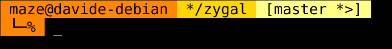
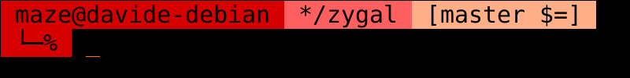

# zygal
Asynchronous lightweight prompt for zsh.


## Features
- **Simple & fast**: it doesn't look fancy, but in return it's fast and
    require no third-party tools setup.
- **Asynchronous**: you shouldn't wait to type in your terminal: those VCS
    symbols you've just seen three seconds ago should wait instead.
- **VCS remote sync**: it's nice to automatically synchronize your local
    repository with the remote one, at least every now and then.
- **Static code generation**: why should your shell execute logic every time
    it draws the prompt, if you set the configuration variables only in
    your `.zshrc`?
- **Customizable colorschemes**: if you're not happy with my aesthetic taste,
    you can [create your own colorscheme](#custom-colorschemes). Just define a
    bunch of variables in a file, and you're good to go.

## Table of contents
<!-- TOC START min:2 max:3 link:true update:false -->
- [Features](#features)
- [Description](#description)
- [Colorschemes](#colorschemes)
- [Installation](#installation)
    - [Dynamic loading](#dynamic-loading)
    - [Static loading](#static-loading)
- [Configuration](#configuration)
    - [Git information](#git-information)
- [Environment pollution](#environment-pollution)
- [Roadmap](#roadmap)

<!-- TOC END -->

## Description
Zygal is meant to be a simple and minimal prompt: no eye-candy python
powerlines, no fancy fonts, just plain Unicode symbols and background colors.

No complex statuses are displayed as well: just *user@host*, the current
working directory, and VCS information when inside a VCS repository. VCS
information is given in a very spartan, colorless `__git_ps1`-like style. Both
[git](#git-information) and [mercurial](#mercurial-information) are supported.

In return, zygal tries to be responsive and efficient. VCS information can
be retrieved asynchronously, so as not to stand in your way in large
repositories. You can start typing your command immediately, and the VCS
segment will appear as soon as it's available, *while* you're typing.

Synchronization with VCS remotes can also be asynchronous, but it would be
just pointless to check if your co-workers pushed something every time
you're about to enter a command, wouldn't it? So, zygal will synchronize
with VCS remotes only every 10 times the prompt is redrawn. Actually, that
number can be set to whatever you want.

As you can see [below](#configuration), there are some configuration
options. They might look cool, but they also need to be checked every time
the prompt is redrawn. This is dumb, as you're very unlikely to change them
once you set them in your `.zshrc`, and those checks will yield the same
results every time. This is why zygal can statically generate a script
meant to be sourced straight away in you `.zshrc`: it contains only the
code that is *actually* executed with the configuration at generation
time, so that there's no longer need to check the options. Basically, the
*content* of the script changes according to the configuration, rather than
the code that is *executed*. (Btw, don't look at that script. It's
horrible, no comments and a lot of hardcoding).

**Why background colors?** I prefer colored text on black background myself,
at least aesthetically. However, have you ever run a very verbose command twice
in a row? It's always annoying to scroll up and squint to find where the output
of the second run begins. And sometimes `less` doesn't go well with colored
output, not even with the `-r` option, and then you have to squint at the
whole output instead of just trying to find where it begins. But if your
prompt is a blast of colors in your  eyeballs, your life is going to be much
easier!

**Why *zygal*?** Well, the dictionary says it means *Having a shape like a
yoke or like the letter H*. It just looks very cool, and plus, it starts
with a *z*.

## Colorschemes
#### Blue


#### Green


#### Orange


#### Red


## Installation
### Dynamic loading
Zygal source files can be sourced directly in your `.zshrc`. In this case, you
can use your favorite package manager to install it. Just remember to define
the configuration variables *before* the plugin manager loads the plugins.

#### Antibody
```bash
antibody bundle davla/zygal path:zsh/theme.zsh
```

#### Antigen
```bash
antigen theme davla/zygal zsh/theme
```

#### Oh-my-zsh
The theme is not available in robbyrussell's repo, as they're not accepting new
themes for the time being. Thus, you need a little more complex setup to get it
to work with oh-my-zsh
```bash
# Cloning this repo to oh-my-zsh custom themes directory
# (leave out --recursive if you plan to use ZYGAL_ZSH_ASYNC_PATH)
git clone --recursive 'https://github.com/davla/zygal' "$ZSH_CUSTOM/themes/zygal"

# Faking the *.zsh-theme file via a symlink
ln -s "$ZSH_CUSTOM/themes/zygal/zsh/theme.zsh" "$ZSH_CUSTOM/themes/zygal.zsh-theme"

# Updating your .zshrc file to use zygal
sed -i 's|ZSH_THEME=".*"|ZSH_THEME="zygal"|' "${ZDOTDIR:-$HOME}/.zshrc"
```
<!-- ##### Prezto -->

#### Zgen
```bash
zgen load davla/zygal zsh/theme.zsh
```

#### Zplug
```bash
zplug 'davla/zygal', as:theme, use:zsh/theme.zsh
```

#### Manual installation
Zygal can of course also be installed manually without the aid of any
framework. You probably don't need instructions in this case, but here they
are as a confirmation that you're doing everything right
:stuck_out_tongue:.

Just clone this repository wherever you want, and source `zsh/theme.zsh` in
your `.zshrc`. Here is just an example:
```bash
# Cloning this repo somewhere in your $ZDOTDIR
# (leave out --recursive if you plan to use ZYGAL_ZSH_ASYNC_PATH)
git clone --recursive 'https://github.com/davla/zygal' "$ZDOTDIR/themes/zygal"

# Sourcing the main theme file somewhere in .zshrc
echo 'source $ZDOTDIR/themes/zygal/zsh/theme.zsh' >> "$ZDOTDIR/.zshrc"
```

### Static loading
Zygal can statically generate a file that only contains the code that is
*actually* run with the current configuration: this saves checking the
configuration options every time the prompt is redrawn. This file is meant
to be sourced in your `.zshrc` and it contains all the zygal code you need,
except for the external resources, namely the
[zsh-async](https://github.com/mafredri/zsh-async) library and the
[`git-prompt`](https://github.com/git/git/blob/master/contrib/completion/git-prompt.sh) script. Since the configuration is effectively "hardcoded"
in this file, it needs to be re-generated anytime you want to
change the configuration options.

In order to generate the file, you need to clone this repo somewhere and
then run the script `zsh/init.zsh`: it uses the configuration variables in
the context it is run in, and outputs to STDOUT. This is the recommended
usage:

```bash
# Cloning this repo anywhere
# (leave out --recursive if you plan to use ZYGAL_ZSH_ASYNC_PATH)
git clone --recursive 'https://github.com/davla/zygal' "$HOME"

# Defining the configuration options BEFORE generating the script.
export ZYGAL_COLORSCHEME='blue'

# Writing the generated script to a file
zsh "$HOME/zygal/zsh/init.zsh" > "$ZDOTDIR/themes/zygal-cache.zsh"

# Sourcing the file somewhere in .zshrc
echo 'source $ZDOTDIR/themes/zygal-cache.zsh' >> "$ZDOTDIR/.zshrc"
```

The content of the static file can also be generated and sourced on the fly
in `.zshrc`, but this will probably not pay off, as the code generation is
definitely not optimized for efficiency. I have no intentions to do so, as
in my opinion this defeats the purpose of static code generation.

```bash
# $ZDOTDIR/.zshrc

# Defining the configuration options BEFORE generating the script.
ZYGAL_COLORSCHEME='blue'

# Generating and sourcing the static script via process substitution.
source <(zsh "$HOME/zygal/zsh/init.zsh")
```

## Configuration
Configuration is handled via the following variables, that need to be defined
before the plugin is dynamically loaded. For static code generation, the
variables need to be defined only when the code is generated.

- `ZYGAL_ASYNC` (default: `remote`):  
    What VCS information should be asyncronously loaded:
    - <a id="async-all">`all`</a>: Both local and remote VCS information are
        asynchronously loaded.
    - `remote`: Only remote VCS information is asynchronously loaded, local
        one is not.
    - `none`: no VCS information is asynchronously loaded.


- <a id="custom-colorschemes">`ZYGAL_COLORSCHEME`</a> (default: `orange`):  
    The colorscheme zygal will use, either as a name or as a path.  

    A name means that the corresponding file in the
    [`colorschemes`](colorschemes) directory will be used.  

    A path to a file uses such file as the colorscheme itself. The only
    requirement is that the following variables are defined (not necessarily
    exported):
    - `ZYGAL_CWD_BG`: background color of the current working directory
        segment.
    - `ZYGAL_VCS_BG`: background color of the VCS segment.
    - `ZYGAL_TEXT_COLOR`: text color, used for all segments.
    - `ZYGAL_USER_HOST_BG`: background color of the *user@host* segment and the
        small part on a new line.


- `ZYGAL_ENABLE_VCS_REMOTE` (default `true`):  
    Whether VCS remote sync features should be enabled at all.


- `ZYGAL_GIT_PROMPT_PATH` (default `/usr/lib/git-core/git-sh-prompt`):  
    The path to the file defining `__git_ps1`. This is the default location
    on Debian systems, so you might need to specify a different one.


- `ZYGAL_VCS_REMOTE_REFRESH_COUNT` (default `10`):  
    The number of prompt refresh that will trigger VCS remote sync.
    Unset if `ZYGAL_ENABLE_VCS_REMOTE` is `false`.


- `ZYGAL_ZSH_ASYNC_PATH` (default: `<zygal_root>/deps/zsh-async`):  
    The path to [zsh-async](https://github.com/mafredri/zsh-async) library.
    Unset if `ZYGAL_ASYNC` is `none`.

    Zygal comes shipped with its own version of `zsh-async` as a submodule.
    However, you might not want to use that, for a number of reasons:
    - You already have this library somewhere else and didn't clone the
        submodule.
    - You use static code generation and want to delete zygal source repo
        afterwards.
    - Whatever your reasons are.
    </ul>

    For these cases, you can set this configuration variable and zygal will
    source `zsh-async` from that location. Be aware that using a different
    version than the submodule one might break zygal!

### Git information
Zygal uses `__git_ps1` under the hood, with barely noticeable adjustments. So,
its configuration variables are used. They can of course be overridden as other
zygal configuration variables. You can find more information about the
available `__git_ps1` configuration variables in the [`git-prompt`](https://github.com/git/git/blob/master/contrib/completion/git-prompt.sh)
file shipped with git itself, in the comments at the beginning of the file.
Below, the `__git_ps1` variables that are set by zygal to a default value if
not defined. All the other ones are unset.

**NOTE**: due to the way `__git_ps1` and zygal work, these variables need to
be set to empty strings, rather than `false`, to be disabled.  

- `GIT_PS1_SHOWDIRTYSTATE` (default: `true`):  
    Shows modifications of unstaged tracked files (`*`) and the presence of
    staged files (`+`).

- `GIT_PS1_SHOWSTASHSTATE` (default: `true`):  
    Shows the presence of stashes (`$`).

- `GIT_PS1_SHOWUNTRACKEDFILES` (default: `true`):  
    Shows the presence of untracked files (`%`).

- `GIT_PS1_SHOWUPSTREAM` (default: `auto`):  
    Shows information about the relative state of the current branch and its
    upstream. The default value displays:
    - `<` when the local branch is behind its upstream.
    - `>` when the local branch is ahead its upstream.
    - `=` when the local branch is even with its upstream.
    - `<>` when the local branch has diverged from its upstream.

    For other values for `GIT_PS1_SHOWUPSTREAM`, check the comments at the
    beginning of [`git-prompt`](https://github.com/git/git/blob/master/contrib/completion/git-prompt.sh)
    to find out more.

- `GIT_PS1_STATESEPARATOR` (default: ` `):  
    The separator between the current branch name and the git status flags.
    Unlike `__git_ps1` this is displayed also when the only flag is the
    upstream one.

### Mercurial information
Zygal implements mercurial information retrieval from scratch, by running a
bunch of `hg` subcommands every time the prompt is redrawn in a mercurial
repository directory. Remote synchronization is implemented by saving the
changeset in a bundle. As mercurial is on average slower than git, it is highly
recommended to set `ZYGAL_ASYNC` to [`all`](#async-all) when working in
mercurial repositories, so as avoid the lag when redrawing the promt. The
active bookmark is displayed when there is one, otherwise the current branch is
shown; some status flags are displayed on the side. These are the configuration
variables, that mirror the ones for git.

- `ZYGAL_HG_BUNDLE` (default: `.hg/changesets.hg`):  
    The bundle file where remote changesets are stored.

- `ZYGAL_HG_DIRTY` (default: `true`):  
    Shows the presence of added, modified and removed files (`+`).

- `ZYGAL_HG_MISSING` (default: `true`):  
    Shows the presence of deleted, but still tracked files (`!`).

- `ZYGAL_HG_REMOTE` (default: `true`):  
    Shows information about the relative state of the local repository and any
    of its remote, that is:
    - `<` when there are changesets in the remote that have not been pulled.
    - `>` when there are changesets in the remote that have not been pushed.
    - `=` when the local changesets are even with the remote.
    - `<>` when there are both non-pushed and non-pulled changesets.

- `ZYGAL_HG_SHELVE` (default: `true`):  
    Shows the presence of shelves (`$`).

- `ZYGAL_HG_SEPARATOR` (default: ` `):  
    The separator between the current bookmark name and the mercurial status
    flags.

- `ZYGAL_HG_UNTRACKED` (default: `true`):  
    Shows the presence of untracked files (`%`).

## Environment pollution
> No sheep had been harmed during the making of this game.  
>
> -- <cite>Insomniac Games - Ratchet & Clank 2: Locked and Loaded</cite>

Zygal needs to pollute your global environment with functions and variables
other than the configuration options. I've taken care of keeping this to a
minimum, by unsetting variables as soon as possible. In order to avoid name
clashes, I prefixed everything with `zygal_`, or `ZYGAL_` for variables.
Furthermore, the [statically generated code](#static-loading) only defines
the functions and variables necessary for the configuration at generation
time.

Here, a list of names defined by zygal in the global environment. The
conditions only apply to static loading, as dynamic sourcing always defines
all of the names. Names in **bold** and configuration variables (not listed
here) are only defined in dynamic loading.

- Functions:
    - `zygal_git_prompt_info`
    - `zygal_hg_prompt_info`
    - `zygal-theme`             <!-- underscore and dash -->
    - `zygal_vcs_info`
- Variables:
    - **`ZYGAL_CWD_BG`**
    - **`ZYGAL_CWD_FORMAT`**
    - `ZYGAL_POST_VCS`          <!-- Hardcode in static -->
    - `ZYGAL_PRE_VCS`           <!-- Hardcode in static -->
    - **`ZYGAL_RESET`**
    - **`ZYGAL_TEXT_COLOR`**
    - **`ZYGAL_THEME_ROOT`**    <!-- Investigate -->
    - **`ZYGAL_USER_HOST_BG`**
    - **`ZYGAL_VCS_BG`**
    - `ZYGAL_VCS_FORMAT`        <!-- Hardcode in static -->

    <!-- ZYGAL_VCS_REMOTE_SYNC_TRIGGER=10 -->

Only if `ZYGAL_ASYNC` is not `none`:
- Functions:
    - `zygal_async`             <!-- Hardcode in static -->
    - **`zygal_async_init`**
    - `zygal_append_vcs`
- Variables:
    - `ZYGAL_ASYNC_RUNNING_COUNT`

Only if VCS remote synchronization is enabled:
- Functions:
    - `zygal_git_sync_remote`
    - `zygal_hg_sync_remote`
    - `zygal_vcs_info_remote`
- variables:
    - `ZYGAL_VCS_REMOTE_COUNT`

Only if `ZYGAL_ASYNC` is not `none` and VCS remote synchronization is
enabled:
- Functions:
    - `zygal_append_vcs_and_stop`

## Roadmap
- Autoload for static code generation.
- More hardcoding in generated code.
- Auto discover git-prompt files.
- Bash port.
- Integrate with zsh theme mechanism.
