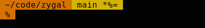
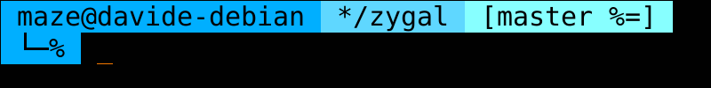
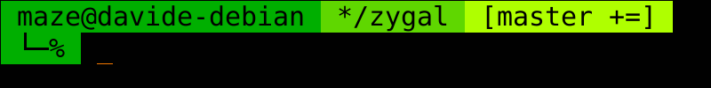
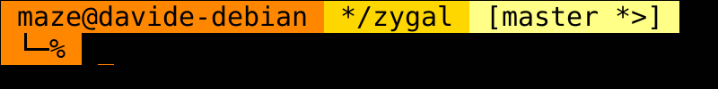
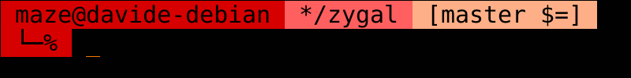

# zygal
Lightweight rust-powered prompt for zsh with compiled-in configuration.



## Main features
- **Embedded configuration**: If you don't change your prompt configuration
  every other day, why should you waste your time *evaluating* it every time
  your terminal draws the prompt?  
  Zygal *embeds* the configuration in the executable, so that it doesn't need
  to check for disabled features or lookup TOML files for color schemes.

- **Minimalism**: Zygal is *meant* to be a minimal prompt, just the current
  directory and some `git` information. This is what keeps it fast and with a
  configuration so simple it can be embedded in the binary.  
  If you're looking for a more information-rich and eye-candy prompt, you will
  *not* find it here.

## Table of contents
<!-- TOC START min:2 max:3 link:true asterisk:false update:false -->
- [Main features](#main-features)
- [Configuration](#configuration)
- [Colorschemes](#colorschemes)
- [Installation](#installation)
  + [Compiling the executable](#compiling-the-executable)
- [In-depth information](#in-depth-information)
- [Roadmap](#roadmap)
<!-- TOC END -->

## Configuration

I know you're skimming through the code snippets the first time you read this
docs, so here you have them at the top of the section.
[Longer explanations](#longer-explanations) below.

Default colorscheme from
[`config/toml/orange.toml`](./zygal-prompt/config/toml/orange.toml):
```toml
# Default colorscheme
# I like orange, who whould have guessed it?

# In addition to an ANSI numeric value, all colors can be set to the "reset"
# special value, which resets all ANSI attributes.
# All colors are optionals, and default to such "reset" special value.
# Read below for more detailed explanations.

# ANSI color codes for the current directory segment.
[current-dir]
background = 208
foreground = 0

# ANSI color codes for the git segment.
[git]
background = 220
foreground = 0

# ANSI color codes for the new-line segment.
[new-line]
background = 208
foreground = 0
```

Default configuration from
[`config/toml/config.toml`](./zygal-prompt/config/toml/config.toml):
```toml
# Default configuration

# The shell Zygal is used in.
#
# Read below for why it's needed.
shell = "zsh"

# The content of the new-line segment.
#
# It's forwarded as-is to the shell, so it can contain any shell-specific
# syntax for its prompt.
new-line-content = "%#"

# Whether to add space around the content in every segment.
space-around = true

# Symbols to use in the git segment.
#
# See below for extra information on the symbols.
[git]

# Shown in case of a merge conflict.
merge = "M"

# Shown in case of a rebase conflict or an in-progress interactive rebase.
rebase = "B"

# Shown in case of a cherry-pick conflict.
cherry-pick = "H"

# Shown in case of a revert conflict.
revert = "V"

# Shown with modified tracked files that are not staged.
unstaged = "*"

# Shown with modified tracked files that are staged.
staged = "+"

# Shown when there are stashes.
stash = "$"

# Shown when there are untracked files.
untracked = "%"

# Displays the state of the local branch in relation to its tracked (remote)
# branch.
# Nothing is shown if the local branch has no tracked branch.
[git.remote]

# Shown when the local branch has commits that are not present on its tracked
# branch.
ahead = ">"

# Shown when the local branch is missing some commits from its tracked branch.
behind = "<"

# Shown when the local branch points to the same commit as its tracked branch.
on-par = "="
```

### Longer explanations

Zygal's configuration consists of two TOML files: one for the colorscheme and
the other for everything else. This makes it easier to swap colorschemes in an
out while keeping the rest.  
The default configuration options are the ones shown in the code snippets
above. The default colorscheme is [orange](#orange).

The TOML files are _not_ read at run-time, but rather at compile-time, so that
zygal's configuration can be _embedded_ in the binary. This improves
performance, likely by the same amount as extremely customized vim
keybindings. :grimacing: For more information on how to provide the
configuration files at compile-time, [read below](#compiling-the-executable).  

Unsurprisingly, the shell integration needs to locate the compiled binary to
execute it. :smirk: By default, it expects a file called `zygal-prompt`
available via `PATH` lookup, but the path to the binary can be customized via
the `ZYGAL_PROMPT` environment variable.

Following, the extra notes for some configuration options that would clutter
the code snippets.

#### `<colorscheme>.toml`

All colors, both `background` and `foreground`, can be specified as their ANSI
numeric color code.

Additionally, the special `"reset"` value can be used to reset all ANSI
formatting attributes, such as background and foreground colors or text
boldness. In practice, it's equivalent to the `\e[0m` ANSI escape sequence.

All colors are optional. If not specified, they default to the `"reset"`
special value.

#### `config.toml`

- `shell`: Necessary to use shell-specific escape strings and color syntax.
  While it's sort of weird to have to specify the shell in a theme that
  consists mostly of a standalone binary, using ANSI colors breaks shell
  plugins and extensions, and that's the last thing we want to happen.

- `git`: All _direct_ configuration keys are optional. In particular, the
  `remote` table as a whole is optional, but its _nested_ keys are not. If a
  key is not present, its symbol is not displayed in the git segment and the
  backing information is not retrieved.  
  The symbols are shown in the order they appear below. For example, with the
  default configuration, if there are both stashes and untracked files, `$%`
  would be displayed.

## Colorschemes
### Blue


### Green


### Orange


### Red


## Installation
Zygal is composed of two parts: the shell integration and the executable.
Sources for both are included in this repository.

The shell integration can be installed via most shell plugin managers. Some
examples:

```sh
# Antidote
antidote bundle davla/zygal path:shell-hooks/zsh-theme.zsh

# Sheldon
sheldon add zygal --github davla/zygal --use shell-hooks/zsh-theme.zsh

# Zgen
zgen load davla/zygal zsh/theme.zsh

# Zplug
zplug 'davla/zygal', as:theme, use:shell-hooks/zsh-theme.zsh

# Zpm
zpm load davla/zygal,source:shell-hooks/zsh-theme.zsh
```

You can also install the shell integration manually. In such case, you probably
know what you're doing, but this is a confirmation that you're doing it right:
:stuck_out_tongue_winking_eye:

```sh
# Cloning this repo somewhere in your $ZDOTDIR
git clone https://github.com/davla/zygal "$ZDOTDIR/themes/zygal"

# Sourcing the main theme file somewhere in .zshrc
echo 'source $ZDOTDIR/themes/zygal/zygal.zsh-theme' >> "$ZDOTDIR/.zshrc"
```

### Oh-my-zsh
Zygal is not avaialble in oh-my-zsh
[out of the box](https://github.com/ohmyzsh/ohmyzsh/#do-not-send-us-themes),
but it can easily be added as an external theme by following the oh-my-zsh
[instructions](https://github.com/ohmyzsh/ohmyzsh/wiki/Customization#overriding-and-adding-themes),
as in this snippet:

```sh
# Clone this repo to oh-my-zsh custom themes directory
git clone https://github.com/davla/zygal "$ZSH_CUSTOM/themes/zygal"

# Fake the *.zsh-theme file via a symlink
ln --symbolic "$ZSH_CUSTOM/themes/zygal/zygal.zsh-theme" "$ZSH_CUSTOM/themes"

# Update your .zshrc file to use zygal
sed --in-place 's|ZSH_THEME=".*"|ZSH_THEME="zygal"|' "${ZDOTDIR:-$HOME}/.zshrc"
```

## In-depth information
If you made it this far into this readme consider subscribing and hitting the
like button - oh no, this is not that type of content. :smirk:

### Compiled-in configuration
The [configuration](#configuration) section shows the code snippets as TOML
files. Those files aren't read at runtime though, but rather *embedded* in the
binary, as I keep bragging about.

My idea is that if you're like me and only change your shell prompt 
configuration once every 3 years or so, *evaluating* the whole configuration
each time your terminal redraws the prompt after executing any command is a
waste of time and resources.  
This is why I designed zygal to evaluate the configuration at *compile time*,
so that once the binary is built, it will know exactly what to do without
even reading the TOML files.

But why even bothering with TOML files in the first place? Using Rust source 
files for configuration would seem more fitting when compiling your own
binary.   
Well, the main advantage of using TOML is that it's harder to accidentally
break zygal's features. For example, most configuration values are translated
into Rust `const`, so that disabled features are removed from the binary by the 
compiler itself via dead code elimination (I did verify with compiler 
diagnostics). This would be quite easy to affect with configuration as Rust 
source, but it's close to impossible to change via TOML files.  
Furthermore, TOML files have less visual clutter than Rust source code, because
of course they're not meant to express as much. :stuck_out_tongue_winking_eye:

So, at the end of the day, how much time have I actually saved, including the
time spent developing this whole setup? Probably less than what the
average vim user saves via their customized keybindings. :grimacing:

### Prompt segments
Zygal's prompt is divided into three segments:

- **Current directory**: Displays the current directory path as the leftmost
  part of the prompt.  
  The home directory is written as `~`.  
  Paths longer than three components are shortened to the last two and prefixed
  with a `*`. For example, `~/very/very/long/path` is shown as `*/long/path`.  
  If the path is *only* the home directory, some extra padding is added to the
  `~` so that it doesn't look too short.

- **Git**: Shows information about the state of the `git` repository in the
  current directory, to the right of the current directory segment.  
  It displays the name of the current branch, together with some symbols that
  indicate a specific state of the `git` repository, such as the presence of
  stashes.  
  If the repository is in detached `HEAD` state, the branch name is replaced by
  the first 7 character of the `HEAD`'s SHA-1.  
  If no git repository is found in the current directory, the segment is not
  shown.

- **New line**: Displays custom text on a new line to the left, below the
  current directory segment.

### Why background colors?
I prefer colored text on black background myself, at least aesthetically.
However, have you ever run a very verbose command twice in a row? It's always
annoying to scroll up and squint to find where the output of the second run
begins. And sometimes paging with `less` doesn't go well with colored output,
not even with the `-r` option, and then you have to squint at the whole output
instead of just trying to find where it begins. But if your shell prompt is a
blast of colors in your eyeballs, your life is going to be much easier!

### Name
Well, the dictionary says it means:

> Having a shape like a yoke or like the letter H.

It just looks very cool, and plus, it starts with a "z".

### Environment pollution
> No sheep had been harmed during the making of this game.
>
> -- <cite>Insomniac Games - Ratchet & Clank 2: Locked and Loaded</cite>

Like most shell prompt themes, zygal needs some global symbols in the shell 
environment. Fortunately, the binary implementation makes the amount really
low.

#### Symbols defined by zygal
- `zygal-theme`: Part of the zsh integration, it's the function added as a
                 zsh hook to change the prompt.

#### Symbols defined by the user
- `ZYGAL_PROMPT`: *Optional* environment variable containing the path to the 
                  zygal compiled binary. If not defined, a file called 
                  `zygal-prompt` is looked up in `PATH`.

## Roadmap
- Bash support
- Integrate with zsh theme mechanism.
