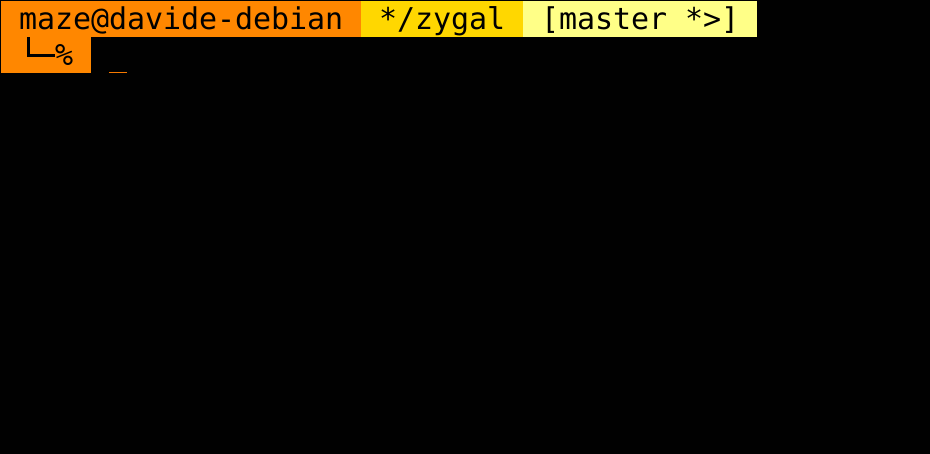

# zygal
Asynchronous lightweight prompt for zsh.

Zygal is meant to be a simple and minimal prompt: no eye-candy python
powerlines, no fancy fonts, just plain Unicode symbols and background colors.
No complex statuses are displayed as well: just *user@host*, the current
working directory, and VCS information when inside a VCS repository. The latter
is very spartan, and simply reuses `__git_ps1` with barely noticeable
adjustments. Git is the only supported VCS so far, but mercurial support is
coming very soon.

**Why *zygal*?** Well, the dictionary says it means *Having a shape like a
yoke or like the letter H*. It just looks very cool, and plus, it starts
with a *z*.

### Features
- **Simple & fast**: it doesn't look fancy, but in return it's fast and
    require no third-party tools setup.
- **Asynchronous**: you shouldn't wait to type in your terminal: those VCS
    symbols you've just seen three seconds ago should wait instead.
- **Static code generation**: why should your shell execute logic every time
    it draws the prompt, if you set the configuration variables only in
    your `.zshrc`?
- **Customizable colorschemes**: if you're not happy with my aesthetic taste,
    you can [create your own colorscheme](#colorschemes). Just define a bunch
    of variables in a file, and you're good to go.

## Colorschemes
#### Orange

## Installation

## Configuration

Configuration is handled via the following variables, that need to be defined
before the plugin is dynamically loaded. For static code generation, the
variables need to be defined only when the code is generated.

- `ZYGAL_ASYNC` (default: `remote`):  
    What VCS information should be asyncronously loaded:
    - `all`: Both local and remote VCS information are asynchronously loaded.
    - `remote`: Only remote VCS information is asynchronously loaded, local
        one is not.
    - `none`: no VCS information is asynchronously loaded.

- `ZYGAL_COLORSCHEME` (default: `orange`):  
    The colorscheme zygal will use, either as a name or as a path.  

    A name means that the corresponding file in the
    [`colorschemes`](colorschemes) directory will be used.  

    A path to a file uses such file as the colorscheme itself. The only
    requirement is that the following variables are defined (not necessarily
    exported):
    - `ZYGAL_CWD_BG`: background color of the current working directory
        segment.
    - `ZYGAL_VCS_BG`: background color of the VCS segment.
    - `ZYGAL_TEXT_COLOR`: text color, used for all segments.
    - `ZYGAL_USER_HOST_BG`: background color of the *user@host* segment and the
        small part on a new line.

- `ZYGAL_ENABLE_VCS_REMOTE` (default `true`):  
    Whether VCS remote sync features should be enabled at all.

- `ZYGAL_GIT_PROMPT_PATH` (default `/usr/lib/git-core/git-sh-prompt`):  
    The path to the file defining `__git_ps1`. This is the default location
    on Debian systems, so you might need to specify a different one.

- `ZYGAL_VCS_REMOTE_REFRESH_COUNT` (default `10`):  
    The number of prompt refresh that will trigger VCS remote sync.
    Unset if `ZYGAL_ENABLE_VCS_REMOTE` is `false`.

- `ZYGAL_ZSH_ASYNC_PATH` (default: `<zygal_root>/deps/zsh-async`):  
    The path to [zsh-async](https://github.com/mafredri/zsh-async) library.
    Unset if `ZYGAL_ASYNC` is `none`.

    Zygal comes shipped with its own version of `zsh-async` as a submodule.
    However, you might not want to use that, for a number of reasons:
    - You already have this library somewhere else and didn't clone the
        submodule.
    - You use static code generation and want to delete zygal source repo
        afterwards.
    - Whatever your reasons are.
    </ul>

    For these cases, you can set this configuration variable and zygal will
    source `zsh-async` from that location. Be aware that using a different
    version than the submodule one might break zygal!

### Git information
Zygal uses `__git_ps1` under the hood, so its configuration variables are used.
They can of course be overridden as other zygal configuration variables. You
can find more information about the available `__git_ps1` configuration
variables in the [`git-prompt`](https://github.com/git/git/blob/master/contrib/completion/git-prompt.sh)
file shipped with git itself, in the comments at the beginning of the file.
Below, the `__git_ps1` variables that are set by zygal to a default value if
not defined. All the other ones are unset.

**NOTE**: due to the way `__git_ps1` and zygal work, these variables need to
be set to empty strings, rather than `false`, to be disabled.  

- `GIT_PS1_SHOWDIRTYSTATE` (default: `true`):  
    Shows modifications of unstaged tracked files (`*`) and the presence of
    staged files (`+`).

- `GIT_PS1_SHOWSTASHSTATE` (default: `true`):  
    Shows the presence of stashes (`$`).

- `GIT_PS1_SHOWUNTRACKEDFILES` (default: `true`):  
    Shows the presence of untracked files (`%`).

- `GIT_PS1_SHOWUPSTREAM` (default: `auto`):  
    Shows information about the relative state of the current branch and its
    upstream. The default value displays:
    - `<` when the local branch is behind its upstream.
    - `>` when the local branch is ahead its upstream.
    - `=` when the local branch is even with its upstream.
    - `<>` when the local branch has diverged from its upstream.
    </ul>

    For other values for `GIT_PS1_SHOWUPSTREAM`, check the comments at the
    beginning of [`git-prompt`](https://github.com/git/git/blob/master/contrib/completion/git-prompt.sh)
    to find out more.

- `GIT_PS1_STATESEPARATOR` (default: ` `):  
    The separator between the current branch name and the git status flags.
    Unlike `__git_ps1` this is displayed also when the only flag is the
    upstream one.

## Roadmap
- More colorschemes.
- Mercurial support.
- Auto discover git-prompt files.
- Bash port.
- Integrate with zsh theme mechanism.
